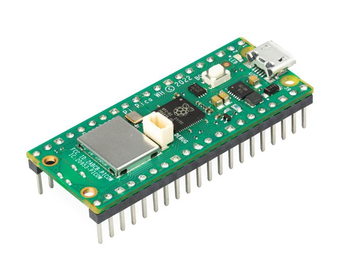
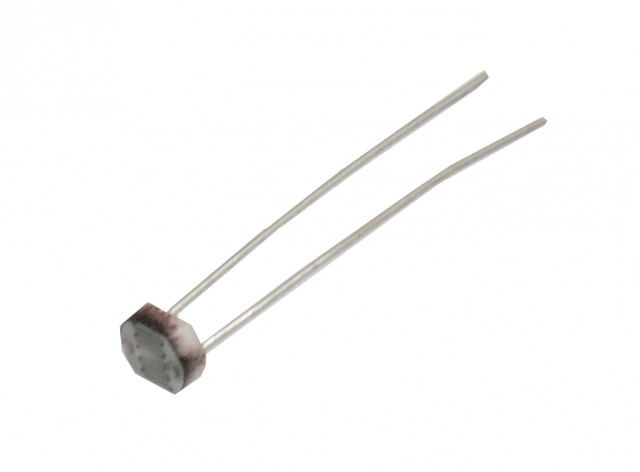
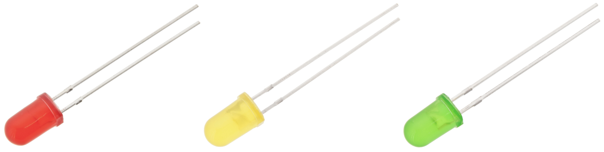
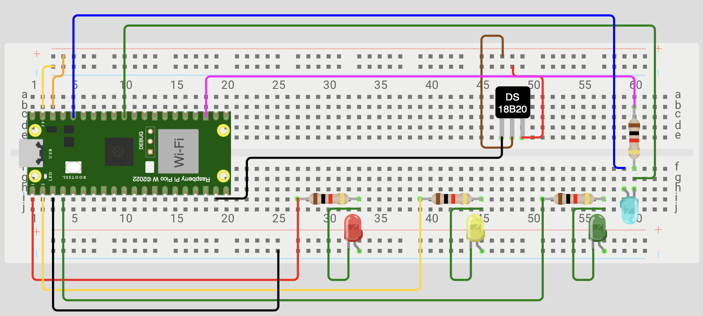
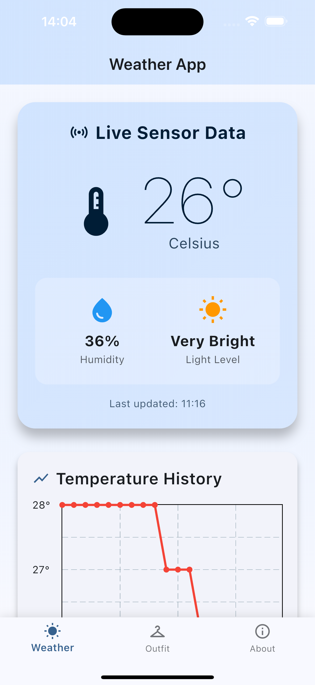
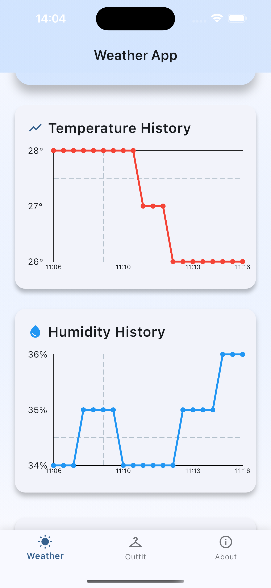
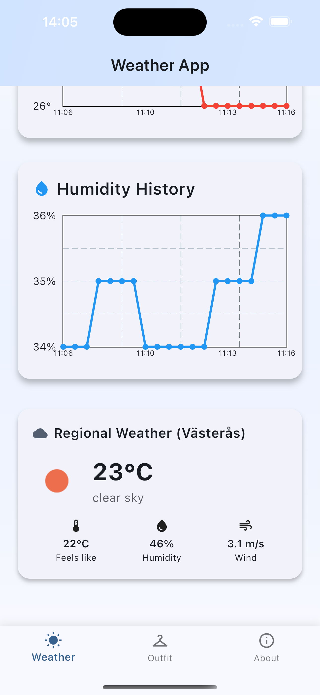
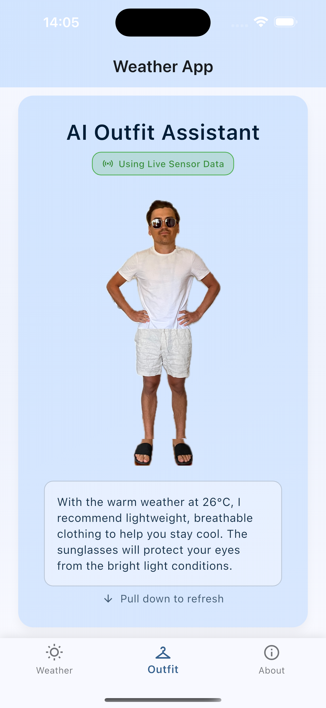
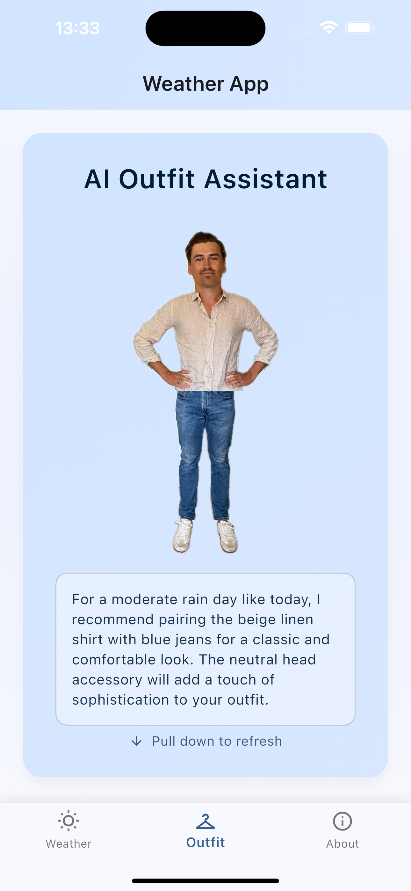

# Smart Weather Station with AI Outfit Recommender

Filip Malm-Bägén / fm222xn

In this project I have created an IoT weather station that collects temperature, humidity and light data using sensors connected to a Raspberry Pi Pico WH. The system uploads this data to Firebase Realtime Database and features a Flutter mobile app that not only visualizes the weather data but also uses an AI model (DeepSeek V3) to recommend what clothes I should wear based on the current conditions. The weather station also has LED indicators that show weather quality at a glance (green for nice weather, yellow for okay conditions, and red for bad weather).

This project should take approximately 15-25 hours to complete depending on your experience with electronics, mobile app development, and AI integration.

## Objective

I chose this project because I wanted to get into IoT and hardware development as a complete beginner, but I didn't want to start with something too complicated. A weather station seemed like a perfect entry point that would teach me the basics of sensors, microcontrollers, and data collection.

What made this project special was combining it with AI to create something practical and fun. I thought it would be cool to have my weather station not just tell me the temperature, but actually suggest what to wear.

The insights I hoped to gain were both technical and practical. I wanted to learn how to work with hardware and seeing how temperature and humidity change throughout the day in my living space. Plus, I wanted to see if an AI could actually give decent outfit advice based on weather data.

## Material

Below is a table of the main components used in the project.

| Component                           | Link                                                                             | Price    |
| ----------------------------------- | -------------------------------------------------------------------------------- | -------- |
| Raspberry Pi Pico WH                | [Electrokit](https://www.electrokit.com/raspberry-pi-pico-wh)                    | 99 SEK   |
| DHT11 Temperature & Humidity Sensor | [Electrokit](https://www.electrokit.com/digital-temperatur-och-fuktsensor-dht11) | 49 SEK   |
| CdS Photoresistor                   | [Electrokit](https://www.electrokit.com/fotomotstand-cds-4-7-kohm)               | 9.50 SEK |
| LED 5mm Red Diffuse                 | [Electrokit](https://www.electrokit.com/led-5mm-rod-diffus-1500mcd)              | 5 SEK    |
| LED 5mm Yellow Diffuse              | [Electrokit](https://www.electrokit.com/led-5mm-gul-diffus-1500mcd)              | 5 SEK    |
| LED 5mm Green Diffuse               | [Electrokit](https://www.electrokit.com/led-5mm-gron-diffus-80mcd)               | 5 SEK    |

In addition, you need a breadboard, resistors (220Ω for LEDs, 10kΩ for photoresistor), jumper wires and a USB-A to micro USB cable. The [Start Kit](https://www.electrokit.com/lnu-starter) from Electrokit is a great option that includes all og these components and then some. The total cost for the Start Kit is 349 SEK.

### Raspberry Pi Pico WH

The Raspberry Pi Pico W is the heart of this project. It's a microcontroller that runs MicroPython and has built-in WiFi, which is perfect for sending data to the cloud. The "WH" version comes with pre-soldered headers, which makes it much easier to work with on a breadboard. It has plenty of GPIO pins for connecting sensors and LEDs.



### DHT11 Temperature & Humidity Sensor

This sensor measures both temperature and humidity. It's not the most accurate sensor, but it's perfect for a beginner project and gives consistent readings that are good enough for weather monitoring and outfit recommendations.


### CdS Photoresistor

A simple light-dependent resistor that changes its resistance based on how much light hits it. I use this to detect how bright it is in the room, which helps determine if it's day or night and influences the outfit recommendations.



### Status LEDs

Three simple 5mm LEDs that act as a quick visual indicator of weather conditions:

- **Green**: Nice weather (comfortable temperature and humidity)
- **Yellow**: Okay weather (somewhat uncomfortable but manageable)
- **Red**: Bad weather (too hot, too cold, or too humid)



## Computer setup

For this project I used several tools to get everything working:

- **Visual Studio Code** - Main IDE for writing the MicroPython code
- **MicroPython firmware** - Needed for the Raspberry Pi Pico W
- **Flutter SDK** - For building the mobile app
- **Firebase Console** - For setting up the database

### Setting up the Raspberry Pi Pico W

First, you need to install MicroPython firmware on the Pico. Download the latest firmware from the [MicroPython website](https://micropython.org/download/RPI_PICO_W/) and follow their installation guide. Basically, you hold the BOOTSEL button while plugging in the Pico, then drag the firmware file to the drive that appears.

### Development Environment

I used VS Code with the Pymakr extension to write and upload code to the Pico. You'll also need Node.js installed for Pymakr to work properly. The setup is pretty straightforward - just install the extension and it guides you through connecting to your device.

### Firebase Setup

Create a new Firebase project and enable the Realtime Database. You'll need to set up authentication and get your API credentials to include in your MicroPython code.

## Putting everything together

The wiring is straightforward and perfect for a breadboard setup. In a production environment, you'd probably want to solder everything onto a proper PCB and maybe add a case, but for development and testing, the breadboard works great.



_Complete breadboard setup showing all connections between the Raspberry Pi Pico W, sensors, and LEDs. The software I used did not have my specific temperature and humidity sensor, so I used a DS18B20 instead. Additionally, it did not have a photo resistor, so I used a blue LED instead to represent it._

## Platform

I decided to use Firebase as my cloud platform for several reasons. First, it's free for small projects like this, and the real-time database is perfect for IoT applications where you want immediate updates. Firebase also integrates really well with Flutter, which made building the mobile app much easier.

The data flow looks like this:

- Raspberry Pi Pico → Firebase Realtime Database → Flutter App → DeepSeek V3 API

I used Firebase becasue I have worked with it before and it is easy to get started with.

## The code

The main code runs on the Raspberry Pi Pico and handles three key functions: reading sensors, managing LED indicators, and uploading data to Firebase.

Here's how the sensor reading works:

```python
def collect_sensor_data():
    try:
        # Read DHT11 sensor
        dht_sensor.measure()
        temperature = dht_sensor.temperature()
        humidity = dht_sensor.humidity()

        # Read light sensor
        light_raw = light_sensor.read_u16()
        light_level = get_light_level(light_raw)

        # Create data structure for Firebase
        data = {
            "timestamp": int(time.time()),
            "temperature": temperature,
            "humidity": humidity,
            "light_raw": light_raw,
            "light_level": light_level
        }
        return data
    except Exception as e:
        print(f"Sensor error: {e}")
        return None
```

The LED indicator system gives immediate visual feedback about weather conditions:

```python
def get_weather_quality(temp, humidity):
    if temp < 5 or temp > 35:
        return "bad"
    elif humidity > 80:
        return "bad"
    elif temp < 10 or temp > 30:
        return "okay"
    elif humidity > 70:
        return "okay"
    else:
        return "nice"
```

One challenge I ran into was the Pico running out of memory after uploading data for a while. I solved this by adding garbage collection and clearing variables after each upload:

```python
# Clear sensor data from memory after upload
sensor_data = None
gc.collect()
print(f"Free memory: {gc.mem_free()} bytes")
```

## Transmitting the data / connectivity

The system uses WiFi to connect to the internet and sends data to Firebase every 30 seconds. I use HTTPS requests to Firebase's REST API, which is reliable and doesn't require additional message brokers.

The data is sent in JSON format like this:

```json
{
  "timestamp": 1735689600,
  "temperature": 23,
  "humidity": 45,
  "light_raw": 32000,
  "light_level": "Bright"
}
```

WiFi was the obvious choice for connectivity since the weather station sits in my room where I have reliable internet. The 30-second interval gives good data resolution without overwhelming the free Firebase quota.

One important addition was NTP time synchronization. The Pico doesn't have a real-time clock, so without internet time sync, all timestamps would be wrong. I added automatic time synchronization at startup and every hour to keep things accurate.

## Presenting the data

The Flutter app has two main pages that make the weather data useful and fun.

### Weather Page

The first page shows:

- Live sensor data (temperature, humidity, brightness) from my weather station
- Historical temperature and humidity graphs
- Regional weather from OpenWeatherMap API for comparison

<div style="display: flex; justify-content: space-between;">
  
  
  
</div>

_The main weather page showing live sensor data, historical graphs, and regional weather comparison._

### Outfit Recommender Page

This is where the project gets interesting. The second page shows:

- A stitched image of me wearing AI-recommended clothes
- An AI-generated text explanation of why these clothes were chosen

The AI clothing system works by analyzing the current weather data and selecting from pre-photographed images of me in different outfits. I spent quite a bit of time photographing myself in various combinations of shirts, pants, shoes, and accessories, then cropping out individual items. The AI uses the filename conventions to pick appropriate combinations (like "tshirt_white.jpg" or "trousers_black.jpg") based on temperature and humidity.

The DeepSeek V3 API then generates styling advice like: "Given the warm weather of 26 degrees and moderate humidity, I'd recommend a light t-shirt and shorts. The breathable fabric will keep you comfortable while the casual style is perfect for a relaxed day indoors."

<div style="display: flex; justify-content: space-between;">
  
  
</div>

_The AI outfit recommender showing a stitched image of clothing recommendations and AI-generated styling advice._

Data is preserved in Firebase indefinitely on the free tier, though I could set up automatic deletion if storage becomes an issue.

## Finalizing the design

The final result exceeded my expectations. What started as a simple temperature sensor became a complete smart home weather system with AI integration. The LED indicators work great for quick visual checks, and the Flutter app makes it genuinely useful for daily outfit decisions.

The AI outfit recommender turned out to be surprisingly accurate and entertaining. It actually gives sensible clothing suggestions based on the real sensor data, and the personalized photos make it feel like having a digital stylist.

If I were to do this project again, I might add more sensors like air pressure or UV detection. I'd also consider making the hardware more permanent with a custom PCB and 3D-printed case. The software side could be expanded with notifications when weather conditions change dramatically.

One learning experience was realizing how important memory management is on microcontrollers. The "out of memory" errors taught me to be more careful about variable cleanup and garbage collection. I also learned a lot about IoT and how to handle real-time data transmission effectively, and combining hardware and software in a single project was a great way to see how all these technologies can work together.

Overall, this project was a perfect introduction to IoT development. It combined hardware, cloud services, mobile development, and AI in a way that's actually useful in daily life. Plus, it's genuinely fun to check what outfit the AI thinks I should wear each morning!


_The completed weather station in its final location, showing the breadboard setup with all components connected and LEDs indicating current weather status._

---

## Setup Instructions

Create a file called `keys.py` in the same directory as your main script:

```python
WIFI_SSID = 'your_wifi_ssid'
WIFI_PASS = 'your_wifi_password'
```

Replace the credentials with your actual WiFi network details, and you're ready to start collecting weather data!
